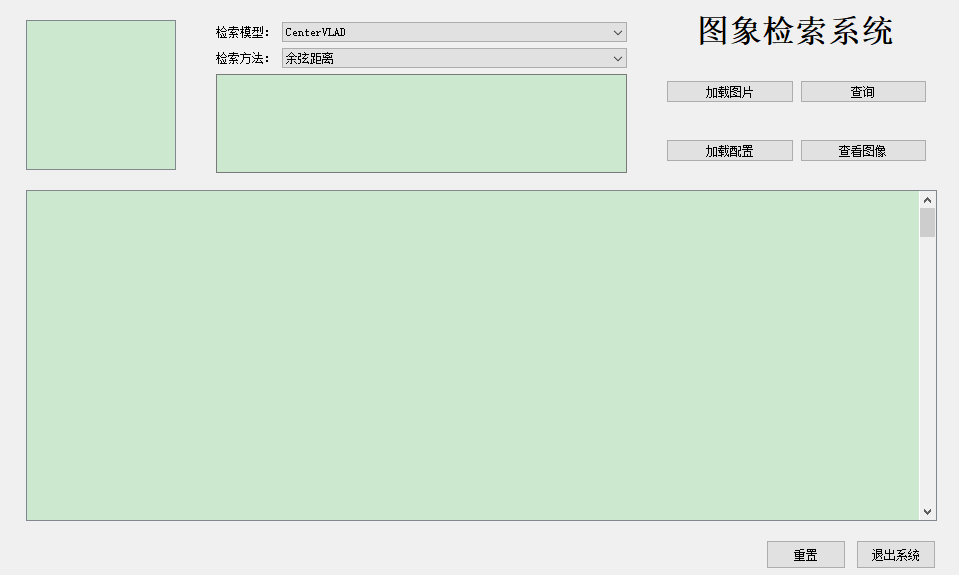

# 图像检索系统:

主要环境：
keras > 2.3
tensorflow 2.x
pyqt5

# 训练自己模型和数据集
1. 在models文件夹nets.py中定义自己的模型，添加模型到load_models.py中
2. 准备数据集，复制config文件夹下default.yaml配置文件，自定义修改里面相应字段
3. 训练分类网络：命令行执行 `python train.py`
   指定配置文件：`python train.py --cfg config\default.yaml`
4. 评估分类网络：`python test.py --cfg config\default.yaml`
5. 检索：`python query.py config\default.yaml`
6. QT UI: `python MainWindow.py`

